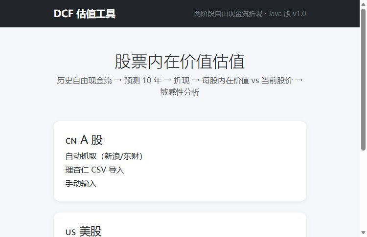
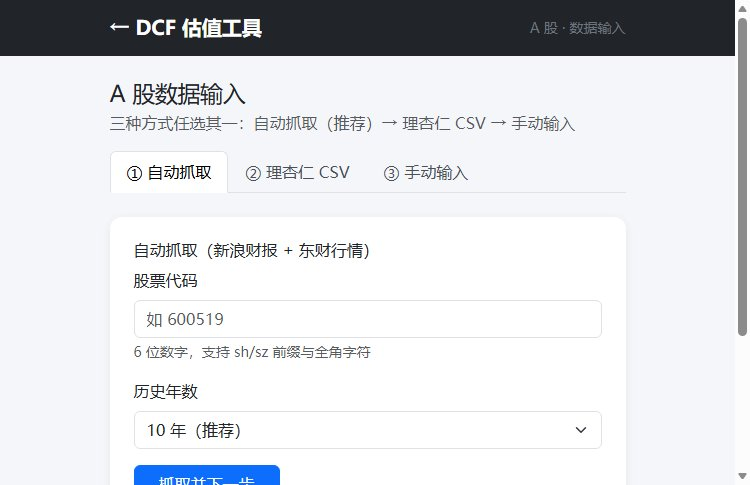
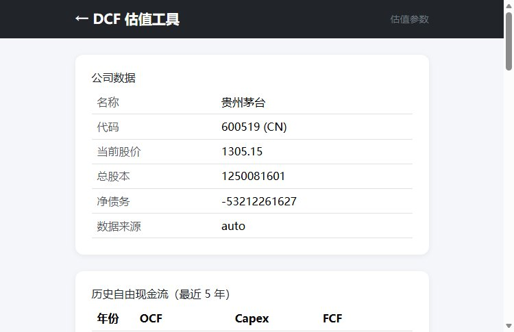
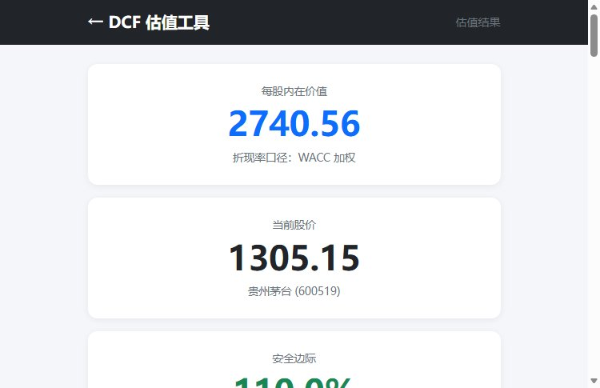

# DCF-Valuation-Tool（两阶段 DCF 估值工具）

基于 **两阶段 DCF（Discounted Cash Flow）模型** 的上市公司估值工具：把公司未来 10 年自由现金流折现为现值，再用 Gordon 模型计算终值，最终得到「每股内在价值」并与当前股价对比计算安全边际。

- A 股：自动抓取财报（新浪财经）+ 股本/股价（东方财富），也可导入理杏仁 CSV 或手动输入
- 美股：按清单手动输入（美股权重数据源多为付费，自动抓取不可靠）
- 输出：每股内在价值 vs 股价、安全边际、折现率 × 永续增长率二维敏感性热力图
- 导出：中文 Markdown 报告 + Excel（9 个 Sheet：说明 / 原始数据 / 假设 / 预测 / 估值 / 三情景 / 历史回溯 / F-Score / 敏感性）

> 与雪球模板/AI 黑箱不同，本项目**逻辑全透明**：所有假设可见、所有参数可手动覆盖、每个数字都可追溯到原始输入。仅供学习研究，不构成投资建议。

## 功能特性

| 模块 | 说明 |
|---|---|
| A 股自动抓取 | 新浪 `getFinanceReport2022` 三表接口，自动拉取 10 年经营现金流、资本开支、营收、EBIT、所得税 |
| 快照数据 | 东方财富 `stock/get`：当前股价、总股本、总市值；K 线接口计算 Beta |
| Beta 计算 | 3 年周线对数收益率 vs 沪深300 回归（CAPM 用），支持手动覆盖 |
| 理杏仁 CSV 兜底 | 中文科目名模糊匹配 + 自动年份排序 + UTF-8/GBK 编码探测；模板含选填进阶科目（净利润/折旧摊销/资产负债/股本） |
| 美股手动输入 | 表单列好所需项目（现金流、资本开支、营收、EBIT、税率、Beta、股本、股价…）；选填进阶科目供 FCFF/F-Score 使用 |
| 多模型切换 | 两阶段（默认）/ 零增长（g=0，保守）/ 三阶段（高增长→成长期→永续，增长率分段线性过渡） |
| 现金流口径 | 简化 FCF（经营现金流−资本开支，默认）/ FCFF（EBIT×(1−t) + 折旧摊销 − 资本开支 − 营运资本增加），数据不足自动回退 |
| 终值方法 | Gordon 永续增长（默认）/ PE 退出法（退出PE × 期末净利润预测，净利润率取自历史数据） |
| 财务质量 | Piotroski F-Score 打分（9 项二值指标，结果页/报告/Excel 展示最近 3 年明细） |
| WACC (CAPM) | `Rf + β × ERP` 自动计算，折现率允许手动覆盖（8%-12% 习惯值与 CAPM 值可对比） |
| 敏感性分析 | 折现率 × 永续增长率二维热力图（ECharts），可直接看到"茅台 β≈0.5-0.8 时 CAPM 折现率仅 5%-7%"这类差异 |
| 报告导出 | Markdown 报告（FCF 趋势、估值瀑布、敏感性热力图说明）+ Excel 多 Sheet |

## 技术栈

- Java 21 LTS + Spring Boot 3.3.5 + Thymeleaf + Bootstrap 5 + ECharts 5.5
- Apache POI（Excel 导出）、Jackson（JSON）、JUnit 5（测试）

## 快速开始

前置要求：**仅需 JDK 21**（无需安装 Maven——仓库内置 Maven Wrapper，首次运行自动下载 Maven 3.9.9；
下载慢可把 `.mvn/wrapper/maven-wrapper.properties` 里的 `distributionUrl` 换成清华镜像，文件内有注释）。
启动脚本（`run.bat` / `run.sh`）会自动检查 Java 版本并优先使用内置 wrapper。

```bash
git clone https://github.com/sunwh6088-maker/DCF-Valuation-Tool.git
cd DCF-Valuation-Tool
./mvnw spring-boot:run       # 方式一：开发模式（内置 wrapper，自动编译，无需装 Maven）
./run.sh                     # 方式二：一键启动脚本（Linux/macOS；Windows 用 run.bat）
```

浏览器打开 <http://localhost:8501> 即可使用（端口可在 `src/main/resources/application.yml` 修改；
若 8501 被占用，可用 `run.bat jar 8502` / `./run.sh jar 8502` 一键换端口，
或直接 `java -jar target/dcf-valuation-tool-1.1.3.jar --server.port=8502`）。

**代理（可选）**：FRED 等境外数据源需要代理时才需设置环境变量，**别人使用无需任何代理配置**（不加代理时自动获取失败会提示手动输入，不影响其他功能）：

```bash
set HTTPS_PROXY=http://127.0.0.1:7890 && run.bat        # Windows CMD
$env:HTTPS_PROXY = "http://127.0.0.1:7890"; .\run.bat   # Windows PowerShell
HTTPS_PROXY=http://127.0.0.1:7890 ./run.sh              # Linux/macOS
```

运行测试：

```bash
./mvnw test                        # 全部单元测试（已装 Maven 也可用 mvn test）
./mvnw test -Dtest=LiveApiSmokeTest  # 真实网络抓取冒烟（需要联网）
```


## 界面预览

| 首页（选择市场） | A 股输入页 |
|---|---|
|  |  |

| 参数页（可手动覆盖） | 结果页（估值 + 敏感性热力图） |
|---|---|
|  |  |
## 使用流程

1. **首页**选择市场：A 股 / 美股
2. **A 股**：输入股票代码（如 `600519`），三选一数据来源：
   - 自动抓取（推荐，免费实时财报）
   - 理杏仁导出 CSV 手动导入（兜底，下载模板对照格式）
   - 手动输入（补全历史财务）
3. **美股**：按页面清单手动输入（无自动抓取）
4. **参数页**：无风险利率（10 年期国债收益率）、Beta、ERP、税率、分段增长率、折现率（可覆盖 CAPM 结果）、永续增长率（2%-3%）
5. **结果页**：查看每股内在价值、安全边际、终值占比、敏感性热力图
6. **下载**：Markdown 报告 + Excel

## 模型口径

- 现金流口径：简化 FCF（经营现金流 − 资本开支，默认）或 FCFF（EBIT×(1−t) + 折旧摊销 − 资本开支 − 营运资本增加）
- 估值模型：两阶段（高增长 → 线性过渡 → 永续，默认）/ 零增长（g=0，仅存量价值）/ 三阶段（高增长 → 成长期 → 永续）
- 终值：Gordon 增长 `TV = FCF₁₀ × (1+g) / (WACC − g)` 或 PE 退出法 `TV = 退出PE × 期末净利润预测`
- 企业价值（EV）= 显式期折现 + 终值折现
- 股权价值 = EV − 净债务（有息负债 − 货币资金）− 少数股东权益
- 每股内在价值 = 股权价值 / 总股本；安全边际 = (内在价值 − 股价) / 股价
- WACC(CAPM) = Rf + β × ERP；Beta 默认 3 年周线 vs 沪深300 回归，可手动覆盖
- Piotroski F-Score：ROA、经营现金流、ROA 改善、应计质量、杠杆、流动比率、新股、毛利率、资产周转率 9 项打分

> 注意：EBIT 采用「营业利润」近似口径（报告中已标注），税率默认按历史有效税率估算，均可手动覆盖。

## 目录结构

```
DCF-Valuation-Tool/
├── src/main/java/com/dcf/
│   ├── model/       纯计算：DcfModel、CAPM、敏感性、结果对象（无 IO 依赖）
│   ├── data/        HTTP 数据层：DataService/HttpUtil + sina/ eastmoney/ csv/ cache/ model/
│   ├── service/     估值编排 ValuationService、BetaCalculator、ReportService
│   ├── excel/       ExcelExporter（POI 多 Sheet 导出）
│   └── web/         PageController、ApiController、ValuationContext（HttpSession）
├── src/main/resources/
│   ├── templates/   页面：index / input-a / input-us / params / result
│   └── static/      Bootstrap/ECharts 本地化 + custom css/js
├── src/test/java/   JUnit 5 单元测试（模型 / 数据 / 导入 / Beta）
├── docs/
│   ├── architecture-java.md   Java 版架构设计
│   └── bug-log.md             Bug 修复记录（原因/位置/测试/影响模块）
├── outputs/         导出产物（Excel + Markdown 报告，已 gitignore）
├── CONTRIBUTING.md  贡献指南
└── LICENSE          MIT 开源协议
```

## 数据来源与免责声明

- A 股财报：新浪财经公开接口；行情/股本：东方财富公开接口（接口字段可能变动，解析层已集中隔离，失败会给出中文提示并可转手动输入）
- 无风险利率：美股用 FRED DGS10（10Y 美国国债），A 股用中债登「中债国债收益率曲线」10 年列，参数页可一键自动获取或手动覆盖
- 理杏仁 CSV 为可选兜底数据源，需自行保证数据准确性
- 本项目仅供学习与研究，**不构成任何投资建议**；估值结果受假设参数影响极大，请谨慎参考

## 分支与 Roadmap

- `main`：Java 版（当前版本 v1.1.3）
- `python-prototype`：Python/Streamlit 原型（⚠️ WIP：目前只提交了核心计算模块 `dcf/`，UI 层 `app.py` 尚未完成，请勿直接运行该分支；后续完成后再合并为正式版）

## Docker 部署（免装 JDK）

```bash
docker build -t dcf-valuation-tool .
docker run -p 8501:8501 -v "$(pwd)/data:/app/data" dcf-valuation-tool
```

浏览器打开 <http://localhost:8501>。`data` 卷用于持久化抓取缓存。

## 部署到公网（让别人直接访问）

本项目是本地 Web 应用，默认只能在部署它的机器上通过 `localhost` 访问。
若要发布到公网、让别人**不装环境直接使用**，可按以下任一方式部署：

- **免费 PaaS（最省事）**：把本仓库部署到 Railway / Render / Fly.io（仓库已内置 Dockerfile），
  构建后即可获得公网地址，适合演示与试用
- **云服务器**：在服务器（需 JDK 21）上运行 `java -jar target/dcf-valuation-tool-1.1.3.jar`，
  再用 Nginx / Caddy 反向代理并绑定域名（HTTPS）
- **内网穿透**：ngrok / frp 适合临时演示，不建议长期公开使用

> 数据源（新浪/东财）对境外服务器可能限流，公网部署建议选国内节点（如腾讯云/阿里云轻量服务器）。

## 参与贡献

欢迎提交 Issue 与 PR，详见 [CONTRIBUTING.md](CONTRIBUTING.md)。